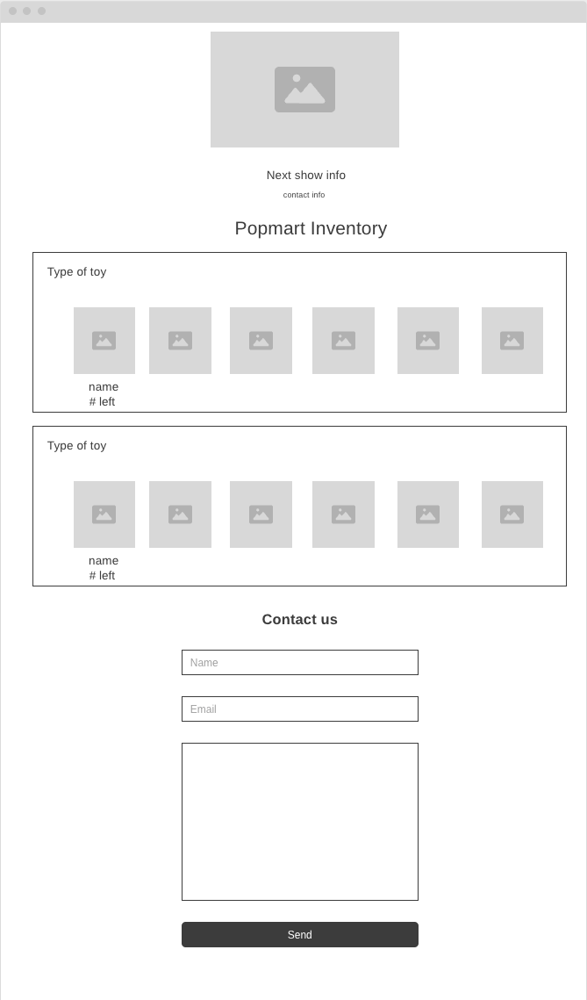

# Azeemo TCG Inventory Page


## Objective
I made this website as an organizational tool to keep track of Popmart inventory. This makes it easy for me to see what I have at a glance and keeps buyers in the loop as well. Items are organized by IP for easy navigation. Item quantities are indicated as well. 


## Technologies

HTML, CSS, JavaScript, Google Sheets API v4

## Wireframes



## MVP

* Hardcoded item quantities
* Collapsible sections
* Responsive design

## Post MVP
- [ ] Pull stock data from external API
    * Google Sheets
- [ ] Find higher quality product images
- [ ] Custom form submission success page
- [ ] Process payments

## Design Elements
### Colors
```
:root {
  --pink: #fbcfee;
  --magenta: #e23372;
  --dark-magenta: #a82355;
  --purple: #9882ce;
  --teal: #5F7DA6;
}
```
### Fonts
Shrikhand & LazyDog